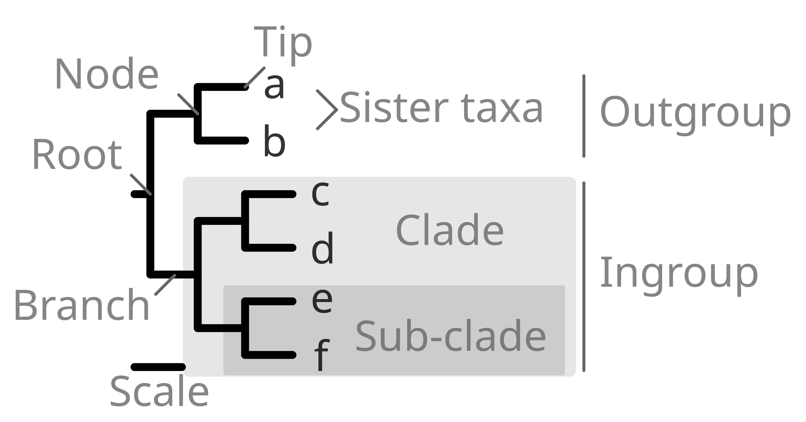

## What is a phylogenetic tree?  
The simplest answer is **a hypothesis** on the evolutionary relationships among the studied set of taxa or *phylogenetic species*, understanding such *species* as genes, proteins or specific morphological traits.  
  
A phylogenetic tree represents a comparative analysis that measures the **accumulated change** between pairs of *species*, normally measured in rate of nucleotide substitution and interpreted as evolutionary change. In this sense, the **phylogenetic distance** between two given species is the accumulated horizontal length between them, independently of their vertical position in the tree.  
  
Briefly, the structure of a tree is rather simple. A phylogenetic tree assumes a **bifurcating diversification** in which a given **branch** splits into two branches in one given **node**. Each node and all its descendent taxa correspond to a (monophyletic) **clade**. A node with no further descendents is a terminal node and is frequently called **tip or leaf** of the tree, representing the *phylogenetic species*.  
  

