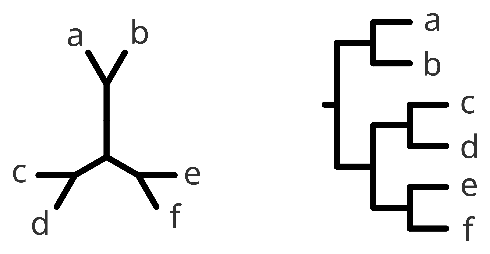

### The root of the tree  
  
The node gathering all *species* is called the **root** of the tree, and is normally used to give a biological and evolutionary interpretation of the tree beyond a pure relative comparison among the *species*. This node, when present, corresponds to the last common ancestor of all *species* considered in the tree. It tells you what are the earliest diverging nodes and therefore the "direction" of the evolution.  
  
In the example below, you have the exact same tree rooted (right) and unrooted (left). In this example the root is splitting the first diverging clade (gathering "a" and "b") and the rest of the taxa.  
  

