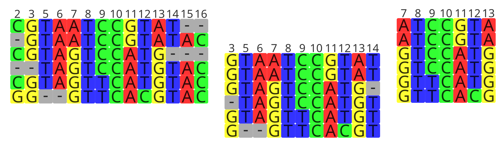

# Trim alignment of redundant or low informative positions/columns (step 3)  
  
In this step we want to remove position that might be irrelevant or add noise.  
  
  
  
We can automatically do that with **trimAl** as follows:  
  
```bash  
trimal -in $ALIGNED -out $FILE -gt X
```  
  
Being X the coverage threshold at a given position. I normally use 30% for a quick analysis and 5% for a more resolutive analysis. Again, depending on your scope you will have to play with different options. Other useful options are "`-st`" (removing positions above certain dissimilarity threshold), "`-nogaps`" (removing all positions with gaps) and "`-noallgaps`" (removing only positions composed only by gaps).  
  
Other softwares highly used are [Gblocks](http://molevol.cmima.csic.es/castresana/Gblocks.html), [ClipKIT](https://github.com/JLSteenwyk/ClipKIT) (which also estimates and keeps parsimonious sites), [Noisy](http://www.bioinf.uni-leipzig.de/Software/noisy/) (able to predict and remove homoplastic sites) or [BMGE](http://gensoft.pasteur.fr/docs/BMGE/1.12/BMGE_doc.pdf) (removing sites that are highly variable/entropic).  
