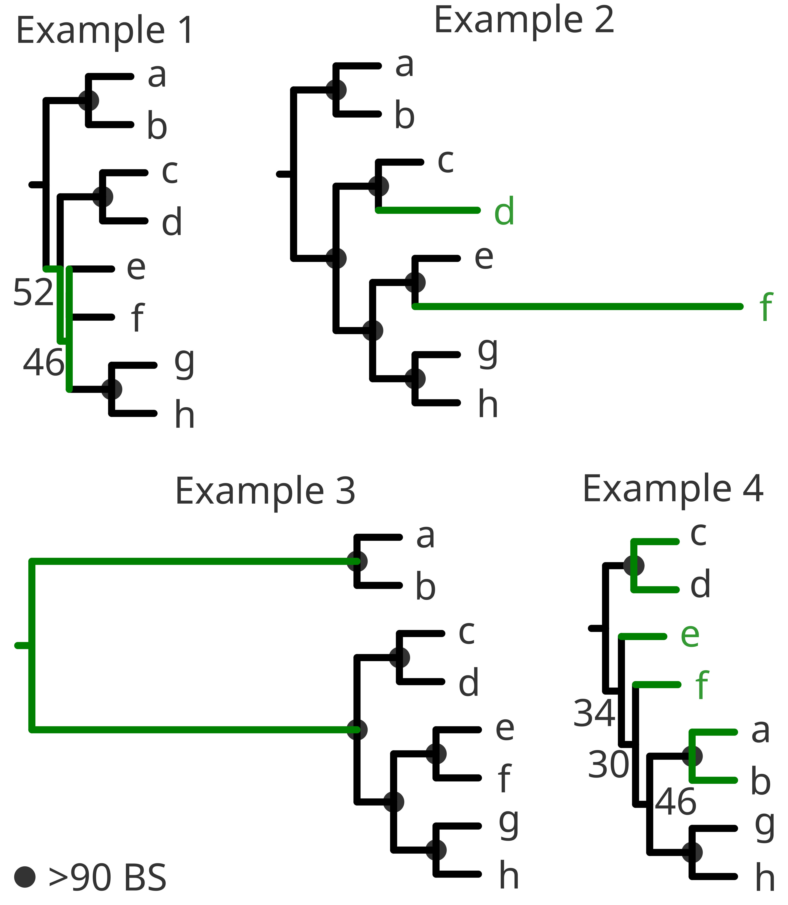

# Interpreting the tree from a methodological point of view
  
At this stage you are looking for artefacts, sequences badly aligned (or even in the reverse order), an appropriate trimming threshold that fits to your sequences, enough bootstraps/generations, ... Briefly, your tree should have:  
- highly supported nodes,  
- no polytomies or no near-0 internal branch lengths,  
- no *very long* branches and  
- the ingroup different from your outgroup(s), but not *too* different.  
Understanding that each concept is relative and may vary among different trees.  
  
Simplifying long explanations:
- Low support in the nodes or near-0 branch lengths (or even **polytomies**) could be because the *species* are too similar to each other and the model fails to converge. It could also be that such similarity might have been created because of too strict trimming thresholds of the alignment. (**Example 1**)  
- Very **long branches** could reflect the opposite problem, in which we have simply selected very distinct *species*, the quality of the *species* is bad (with many errors or insertions), the alignment failed or even that the trimming was too gentle. (**Example 2**)  
- If the outgroup and the ingroup appear very distant from one another you might have selected the wrong outgroup. Check the literature again and try to select a more related group as an outgroup or try [BLAST](https://blast.ncbi.nlm.nih.gov/Blast.cgi?PROGRAM=blastn&PAGE_TYPE=BlastSearch&LINK_LOC=blasthome) to retrieve closely related sequences (if applicable). (**Example 3**)  
- It could also happen that the different outgroups do not appear according to the literature and some clades of the ingroup within or between the different outgroups. Then, most likely **[chimeric sequences](https://en.wikipedia.org/wiki/Chimera_(molecular_biology))** might be present. Chimeric sequences also tend to appear alone at early diverging positions and sometimes at relatively long branches. (**Example 4**)  
  
  
  
Long branches deserve a special mention when (for example) you have several clades present in independent long branches and are *a priori* phylogenetically related (sister groups). This effect could be due to the so called **Long Branch Attraction** artefact, and the tree shows two groups closely related but simply because they are very different from all the rest and not necessarily because they are similar (or related) to one another.  
  
When chimeric sequences come from very different parent sequences, it might be easy to spot, since all the topology of the tree might be affected. Especially when using several outgroups. But when the chimaera is formed from closely related groups it might be problematic to identify. Most of the softwares that perform chimeric detection (such as [mothur](https://mothur.org/) or [vsearch](https://github.com/torognes/vsearch)) rely on the reference database of choice, so you have to be cautious when providing the reference database.  
    
The different topological possibilities of a tree are very big, and therefore any list of possible methodological problems will be far from complete. I hope with the few examples I am providing, you get the rationale to identify methodological issues.  
