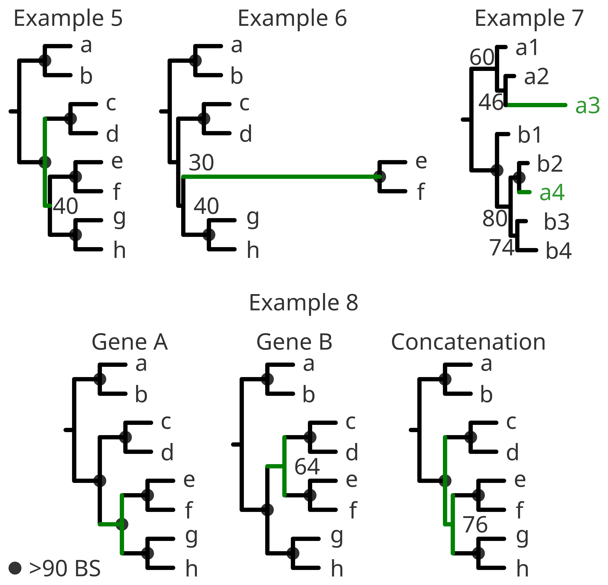

### Interpreting the tree from a biological point of view
  
A pure methodological examination of a tree is very important to help you identify problematic steps on the pipeline. However a biological interpretation of your tree goes tightly connected. Understanding the tree from a biological point of view helps to resolve or neglect potential issues identified from a pure methodological point of view and eventually, it will contribute to decide on whether keeping or removing certain *species*.  
For example:  
- As we have seen in the methodological check, near-0 internal branche lengths or poorly supported nodes might be a problem. But if you find highly supported clades and only few unresolved internal nodes with very short branches, the problem might be intrinsic to the *species* and simply phylogenetic patterns cannot be resolved with the given data. We normally interpret such events in terms of evolution as that "the diversification happened very fast". (**Example 5**).  
- Similarly, long branches can have a biological meaning despite a correct methodological approach. The **rate of evolution** among eukaryotes varies widely from clade to clade. In this sense one specific clade with a very diverging trait can appear in a long branch, highly supported within it, but very poorly resolved regarding its position in the tree. In this case, resolving its phylogenetic relationship among other groups is not possible with the given data. The best option would be to choose a different trait (if possible) and discuss the different approaches. (**Example 6**).  
- A very common source of conflict is the presence of contaminations or mislabeled sequences. The true information for phylogenetic analysis is the actual gene or protein sequence. Yet the name of such a sequence (either taxonomical, environmental or other associated metadata) is an identifier for human readability. Therefore the identifier should be treated with caution and interpreted according to your scope and methodological analyses regardless of its origin. (**Example 7**).  
- When combining different genes or proteins (also called as concatenation) it might happen that they show different phylogenetic patterns. In this case it is important to understand the nature of those genes or proteins and discuss the results accordingly. They might have different evolutionary rates, different selection pressure, different phylogenetic information or even different lengths regarding the rest of the sequences in the alignment or being badly annotated. (**Example 8**).  
- ...   
  
  
  
#### What is a "well-supported" clade?  
  
Identifying well defined clades is a difficult task and there are no universal thresholds to define such a thing.  
For example: when using only one or two genes, if a clade has >90% bootstrap or >0.9 posterior probabilities you can be very confident of the support of that clade. On the contrary, if a clade has <60% BS or <0.6%, that specific clade might be close to random selection. When using multiple concatenation of genes, these thresholds could increase considerably, and not relying on a clade that has 85% BS or 0.85 PP.  
Besides, the tree topology might influence the decision of calling a clade "well-supported". Therefore and once again, this might depend on the scope of your analysis and the data used.  
  
#### Identifying equivalent lineages  
  
Similarly to the previous subsection, identifying equivalent lineages will depend on the data used, the tree topology and the support of the clades. However, if two independent clades have relatively similar branch lengths and their distance to the root is somehow similar, we can argue that their hierarchical classification might be similar (i.e.; class, order, family).  
