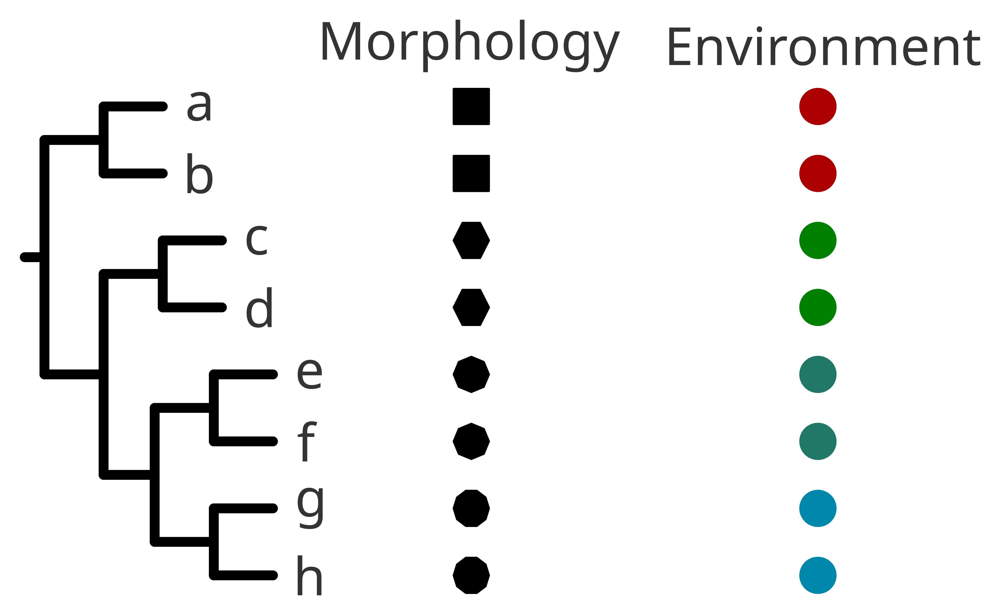

### Integrating the tree in a broader evolutionary context
  
We have performed a technical check of the tree, and it seems OK with the exceptions of a few minor technical discrepancies. We have interpreted those discrepancies from a biological point of view, and they are easily explained with the given dataset.  
Now we can pay attention to the identifiers from the tree tips and build an evolutionary hypothesis for our tree. It is time to integrate the previous interpretations with the rest of the information we had before inferring the phylogenetic tree.  
If your scope was ecological, do you find any ecological pattern? If you performed a morphological and molecular characterization, do you find any morphological pattern? How is it compared with your initial hypothesis? Your work now will be to find those patterns, they might or they might not agree with the previous knowledge.  
  
  
  
Lastly, it is important to integrate the meaning of your tree in the current state of the art. What is your tree bringing to the current state of the art of your field? How is it compared to the previous existing knowledge?  
